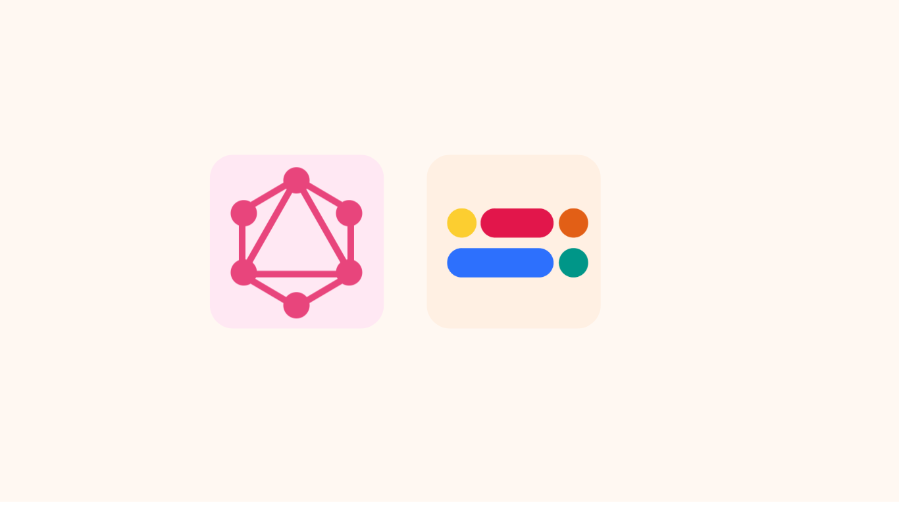
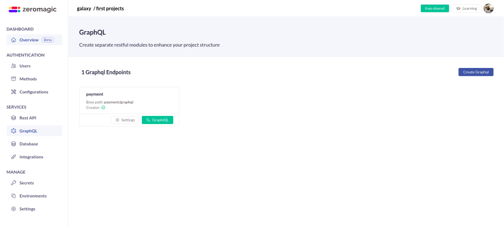
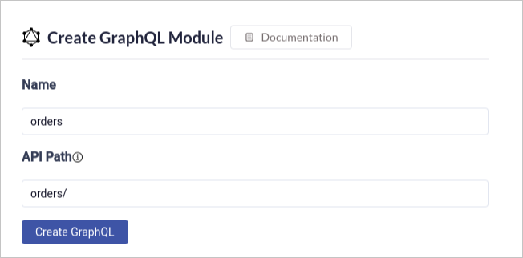
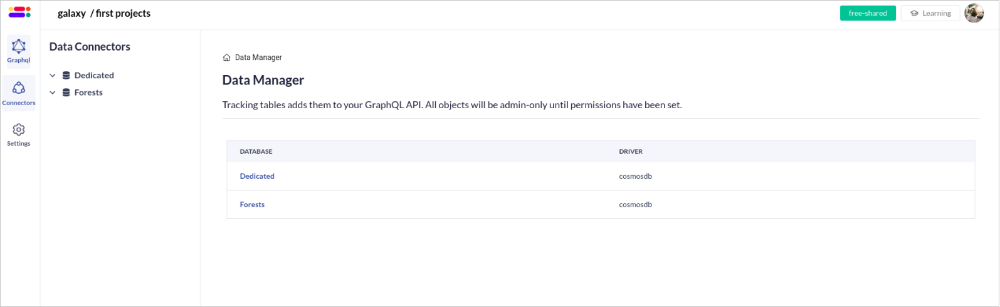

GraphQL has taken the API world by storm, offering a powerful and flexible way to query and manipulate data. It allows you to request exactly the data your application needs, leading to cleaner code and faster development.

In this blog post, we'll dive into how you can leverage the Zeromagic Platform to create your very first GraphQL API. We'll explore the platform's features and guide you through the setup process, making it easy to get started with GraphQL and unlock its benefits for your projects.
<!-- truncate -->

### Step 1: Login to Project Console
Login to [Zeromagic Platform](https://github.com/) and go to you `Project Console`. Now navigate to `GraphQL` in the sidebar of the console.
 



### Step 2: Create a GraphQL Endpoint

Navigate to `Create GraphQL` button and this will open a form to create a GraphQL endpoint.
- Name : Name of the Graph API
- API Path: Define the base URL path that will be used to access the API endpoints. 

:::info Important

`graphql/` will be appened to the base URL path. You can not pass anyother parameters such as query parameters, etc in the API Path field.

:::

```jsx title="Example"
API Path: orders/
Final GraphQL Endpoint: orders/graphql/
``` 



Once created, click on the `GraphiQL` button, this will take you to the GraphQL console.

### Step 3: Create a Database
Create a database (BYOD or on-premises ) named `Forests` in your Database section in the project console.

:::tip Reference
Refer here to know how to [Connect Databases to Zeromagic](/datasources/quickstart/)
:::

The created database will be listed in the `Connectors` section in the `GraphQL Console`



### Step 4: Setup Data connectors

Establish connections to your underlying data sources. These could be databases, APIs, or other services that hold the actual data your GraphQL endpoint will serve. Choose the appropriate logical models for the tables in data source.Configure these connectors to allow your GraphQL schema to interact with the data effectively.

:::tip Reference
- [Learn about Data connectors](/graphql/dataconnectors/)
- [Connect Databases to Zeromagic](/datasources/quickstart/)
:::
### Step 5: Test in GraphiQL

Now that your data connections and schema are set up, it's time to test it out! Here, you can interact with your GraphQL endpoint and test your queries. The GraphiQL interface includes three useful menus on the right sidebar:

- **Show Documentation Explorer:** Access a detailed, interactive representation of your GraphQL schema. This helps you understand the available data types, fields, and relationships within your data.
- **Show History:** Review your previously executed queries for quick reference.
- **Show Data Explorer:** Visually navigate your data structures and explore them without writing complex queries.


