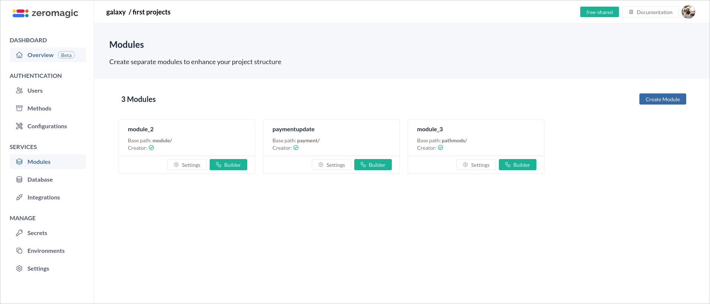
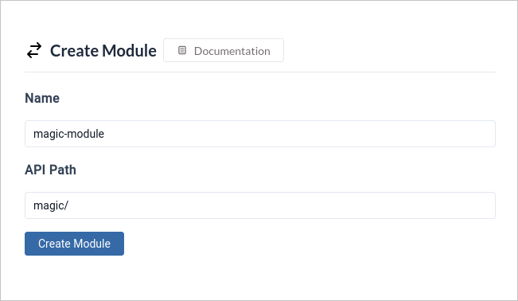
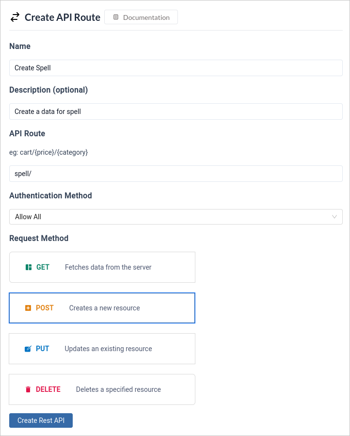
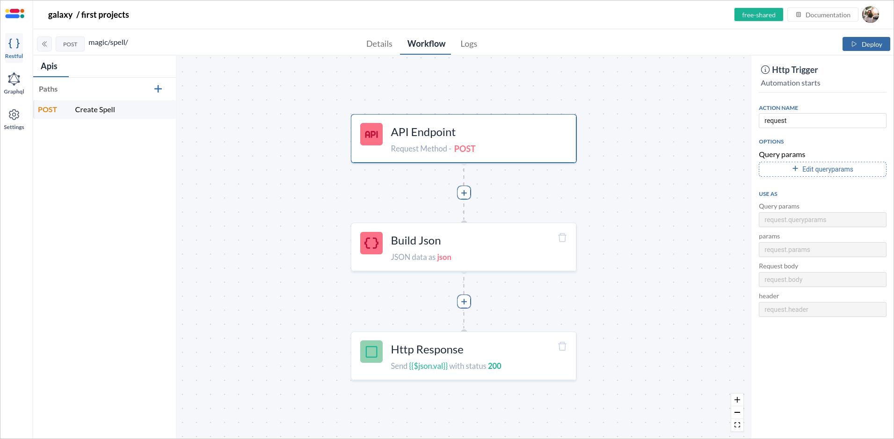
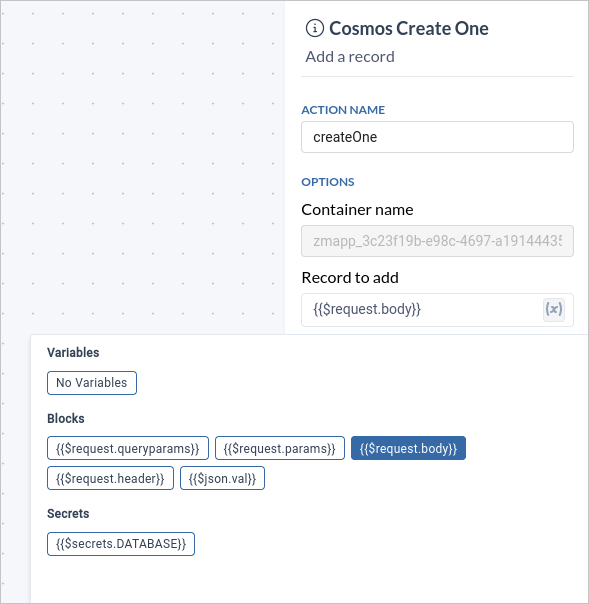
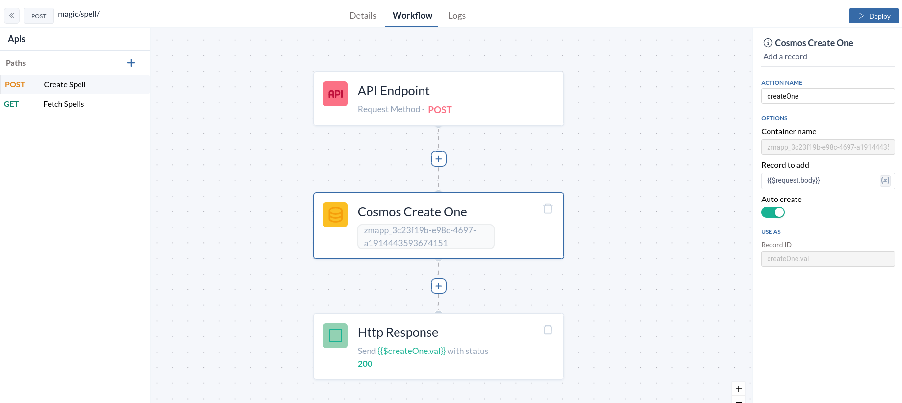
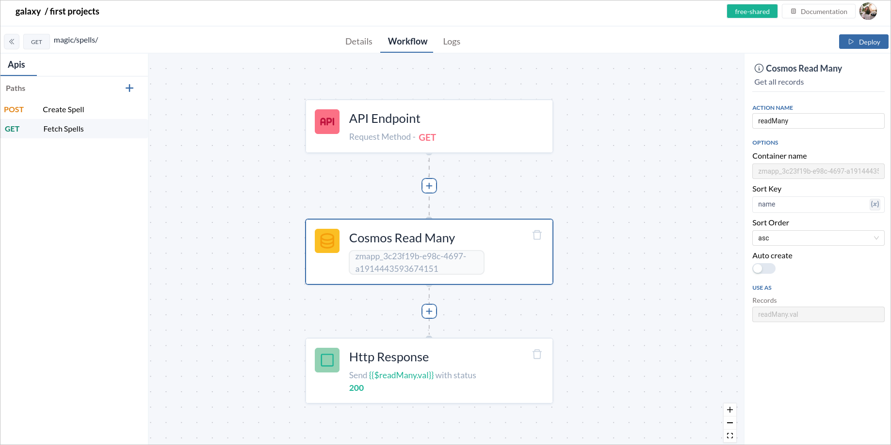

In this blog post let expore how you can create your first rest API on Zeromagic Platform. 

### Step 1: Login to Project Console
Login to [Zeromagic Platform](https://github.com/) and go to you `Project Console`. Now navigate to `Modules` in the sidebar of the console.

<!-- truncate -->

:::info Information

Modules are often used to structure and organize API endpoints when building RESTful APIs. Each module can represent a specific domain or resource within your application.
 
:::

### Step 2: Create a new Module

Now click on `Create Module` button to create a new module. This open a form to create a new module. Enter the `Name` and `API path` of the module.

> Note : API Path only follows the trailing slash.

Once module is created, click on the module and you will be directed to the Flow Builder Page where you can create your `Rest API`. 

### Step 3: Create a new Rest API

Look for a button labeled `Create Rest API` or `+` in the API List space within the interface. This button will initiate the process of creating a new REST API definition.
    - `Name` : Name of the API
    - `Description`:Short description of the API
    - `API Route`: Define the base URL path that will be used to access the API endpoints. This path can include path parameters (indicated by `{<param>}`) to capture dynamic values in the URL.    
    **Example**: `/users/{userId}` (where `{userId}` would be a variable placeholder captured from the request URL).
    - `Authentication Method`: If your API requires authentication to access certain or all resources, select the appropriate authentication method. Check on the Authentication to know more about authentication methods. 
    - `Request Method`: Specify the HTTP method that clients should use to interact with your API.

### Step 4: Update Workflow to create Spell data in Database

The Worflow builder has 3 basic Blocks such `API Endpoint`, `Build JSON` and `HTTP Response` in the workflow canvas.  

Now let's add `Cosmos Create One` block in the workflow to create `Spell` data in the database. 

> Assuming that the database is configured in the Database section of the Project Console.

In the options panel of the `Cosmos Create One` you can find the **container name** is predefined in `Free-Plan`. Now in the `Record to add` field set the body data of request. 

Toggle on `Auto create` to automatically create a new instance of the schema with the specified container if it is not already created.

Now in the `HTTP Response` update the **Response Variable** to `{{$createOne.val}}` which is output of the Cosmos Create One.

:::info Note

HTTP Response blocks accepts only **JSON** as response. Make sure your value in response is a JSON.

:::

Now click on the `Deploy` button such that the API is automatically deployed and can be accessed in the specific environment.

### Step 5: Test the POST method

You can access the API by selecting the specific environment you need. You can find the **API Endpoint** in the `Details` tab.

### Step 6: Create new flow to GET Spell Data from DB

Now let's create a new **Rest API** to fetch Spell data. Click on the `+` icon on the RestAPI List section. Enter the details of the API required to fetch the Spell data.

Add the `Cosmos Read Many` block in the workflow to get all the information of the `Spells` from the database. Add the `Sort Key` and `Sort Order` in the Options panel.

Now in the `HTTP Response` update the **Response Variable** to `{{$readMany.val}}` which is output of the Cosmos Read Many.

Now click on the `Deploy` button such that the API is automatically deployed and can be accessed in the specific environment.

### Step 7: Test the GET method

You can access the API by selecting the specific environment you need. You can find the **API Endpoint** in the `Details` tab.