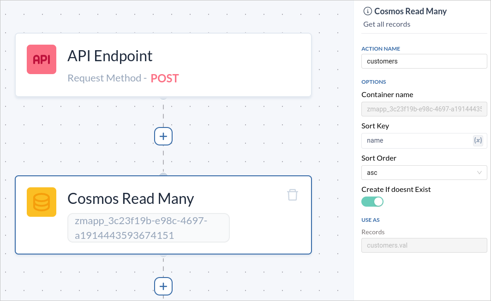
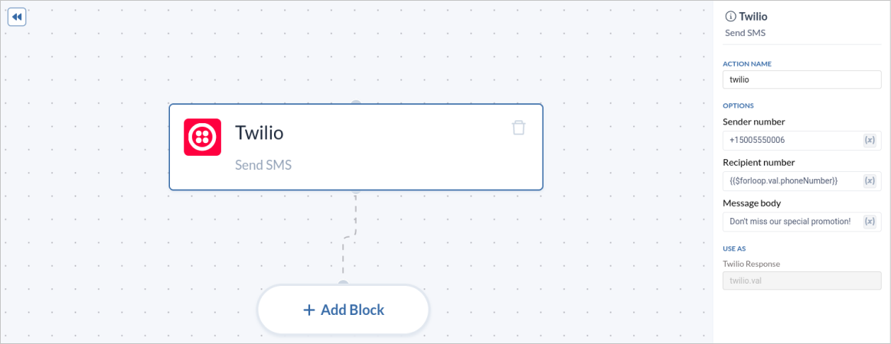
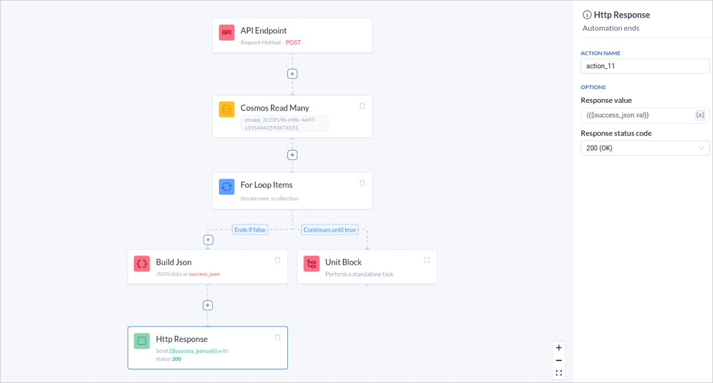

<!-- For loops are a fundamental programming construct that allows you to repeat a set of actions a specified number of times. When integrated into workflows, for loops can make your processes smarter and more efficient by automating repetitive tasks. This blog post will guide you through the world of for loop conditions in workflows, demonstrating how to use them effectively with start, stop, and step values. -->

## How ForLoop Works:
<!-- A for loop is a control flow statement that executes a block of code a certain number of times. It typically includes three main components: -->

A for loop is a control flow statement that executes a block of code for each item in a collection. This approach simplifies looping by allowing you to directly work with collections, making your workflows more intuitive and streamlined.

1. **Collection**: The array or list of items that the workflow will iterate over. 

2. **Current Item:** The current item being processed in the loop.


<!-- The workflow will loop over the array of objects and each object can be accesses within the for loop by using the syntax  -->
<!-- 
```
{{$action-name.val.object-key}}
``` -->

<!-- 1. **Start:** The initial value of the loop variable.
2. **Stop:** The condition that, when met, will terminate the loop.
3. **Step:** The value by which the loop variable is incremented or decremented each iteration. -->

By setting these values, you can control how many times the loop runs and tailor it to your specific needs.

### 1. Get Customer data from database

Create a `Cosmos Read Many Block` to fetch all customers from the database.



<!-- truncate -->

### 2. Define the For Loop Collection:

- Loop over collection: Set the customer collection.
```jsx
for customer in customers:
// Send SMS to each customer
```

<!-- - start: Set the initial index to `0`.
- stop: Set the condition to the length of the customer list.
```jsx
len({{$customers.val}})
```
- step: Increment the index by `1` for each iteration.

```jsx title="Sample Pseudo Code"
for (let i = 0; i < customers.length; i++) {
    // Send SMS to each customer
}
``` -->


### 3. Send SMS Using Twilio

Click on the expand icon on `Unit Block` and it will expand you to Builder page where you can build logics of the loop.

```jsx title="Sample Pseudo Code" 
for customer in customers:  

    twilioClient.messages.create({
        body: "Don't miss our special promotion!",
        from: '+YourTwilioNumber',
        to: customer.phoneNumber
    })
```

Add a `Twilio` block inside the loop. 
To access the current object in the collection, use the syntax below 
```jsx 
{{$forLoop.val.phoneNumber}}
```

:::info Info 
Make sure that Twilio is connected to the platform. Guide to Twilio integration can be found [here](/integrations/twilio/)
:::

<!-- ```jsx title="Sample Pseudo Code"
for (let i = 0; i < customers.length; i++) {
    let customer = customers[i]; 

    twilioClient.messages.create({
        body: "Don't miss our special promotion!",
        from: '+YourTwilioNumber',
        to: customer.phoneNumber
    })
}
``` -->



### 4. Send Success Response

Create a `Build JSON` block to be used in `Http Response` block to send a successful response.

```jsx
{
    "response": "Promotions sent successfully"
}
```


